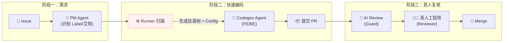
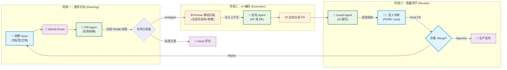

# 🌊 VibeFlow: AI-Native Development Workflow


**VibeFlow** 是一个探索性的 GitHub Action 工作流套件，旨在通过 AI Agent (Claude-3.5-Sonnet) 将 GitHub Issue 直接转化为可运行的代码 PR，实现“需求即代码”的自动化闭环。

## 1. VibeFlow 思维导图 (Conceptual Mind Map)


这个流程图强调了**“人类设定目标，AI 执行路径，人类验收结果”**的循环。AI 不再是一个简单的辅助工具，而是介入了特定环节的“虚拟员工”。

## 2. VibeFlow 技术架构流程图 (Technical Architecture Flowchart)

这张泳道图展示了如何在 GitHub 平台、GitHub Actions 运行环境和 OpenRouter AI API 之间流转的。



**事件驱动 (Event-Driven)**：整个系统是“休眠”的，只有当 GitHub 上发生特定事件（开 Issue、写评论、提 PR）时才会被唤醒。这非常高效且节省资源。

**上下文增强 (Context RAG)**：注意 R2b 节点。这是我之前建议补全的关键步骤。AI 不是在真空中写代码，Action Runner 必须先读取当前仓库的文件结构和关键配置（如 go.mod, package.json），把这些“上下文”一起喂给 AI，它才能写出正确的、可运行的代码。

## 🚀 核心功能

### 1. 📝 Spec Generation (规划)
当你创建一个 **Issue** 时，VibeFlow 会自动分析需求，生成一份结构化的 **Vibe Relay Card**（技术接力卡）。
- **作用**: 将模糊需求转化为 Context, Backend, Frontend 明确的技术方案。
- **触发**: `New Issue`

### 2. ⚡️ Auto Codegen (编码)
在 Issue 评论区输入 `/codegen` 指令，AI 工程师将接管键盘。
- **流程**: 读取 Issue 上下文 + 项目目录结构 -> 生成代码 -> 自动创建分支 -> 提交 PR。
- **触发**: `Issue Comment: /codegen`

### 3. 🛡️ Night Watch (审查)
当有 **Pull Request** 提交或更新时，AI 会自动进行 Code Review。
- **输出**: Vibe Score (1-10)、关键 Bug 预警、优化建议。
- **触发**: `PR Open / Synchronize`

---

## 📚 文档结构

项目文档已重新组织，更加清晰专业：

```
vibe-engineering-playbook/
├── README.md                           # 项目主文档
├── DEPLOYMENT.md                       # 部署指南
├── docs/
│   ├── workflow/                       # 工作流程文档
│   │   ├── agent-protocol.md          # AI Agent 协议
│   │   ├── daily-todolist.md          # 每日工作清单模板
│   │   └── review-checklist.md        # 代码审查清单
│   ├── development/                    # 开发指南
│   │   ├── local-development.md       # 本地开发指南
│   │   ├── project-design.md          # 项目设计文档
│   │   └── backend-spec.md            # 后端技术规范
│   ├── templates/                      # 各类模板
│   │   └── pull-request-template.md   # PR 模板
│   └── examples/                       # 示例文档
│       └── example-issue.md           # Issue 示例
├── backend/                            # 后端代码及文档
└── frontend/                           # 前端代码及文档
```

### 核心文档链接
- **开始使用**: [本地开发指南](docs/development/local-development.md)
- **部署**: [部署指南](DEPLOYMENT.md)
- **工作流**: [AI Agent 协议](docs/workflow/agent-protocol.md)
- **代码审查**: [Review Checklist](docs/workflow/review-checklist.md)

---

## 🛠️ 安装与配置

### 1. 设置 Secrets
在你的 GitHub 仓库 `Settings` -> `Secrets and variables` -> `Actions` 中添加：
- `OPENROUTER_API_KEY`: 你的 OpenRouter API Key (推荐使用 Claude 3.5 Sonnet 模型)

### 2. 部署 Workflow
将本项目 `.github/workflows` 目录下的 YAML 文件复制到你的仓库中：
- `vibe-spec-guard.yml`: 处理 Issue 分析和 PR 审查。
- `vibe-codegen.yml`: 处理代码生成指令。

### 3. 权限设置
确保你的 Workflow 拥有读写权限。在 `.github/workflows` 文件中已配置：
```yaml
permissions:
  contents: write
  pull-requests: write
  issues: write
