# 🌊 Vibe Engineering Playbook

> **AI-Native 全栈开发工作流系统** - 通过 GitHub Actions 和 AI Agent 实现从 Issue 到代码的自动化闭环

[](LICENSE)
[](https://github.com)
[](https://openrouter.ai)

**Vibe Engineering Playbook** 是一个完整的 AI 驱动开发工作流系统，通过 19+ 个 GitHub Actions 工作流，实现从需求分析、代码生成、错误修复到部署监控的全自动化流程。系统支持前后端分离开发，自动管理功能分支，并提供完善的错误处理和监控机制。

---

## ✨ 核心特性

### 🤖 AI Agent 工作流

- **智能任务路由**: 自动分析 Issue 复杂度（简单/中等/复杂），路由到对应的 Agent
- **代码生成**: 支持前端（Next.js + TypeScript）和后端（Go + Gin）自动代码生成
- **UI 设计规格生成**: 从产品需求自动生成 UI 设计规格文档
- **错误自动修复**: CI/CD 失败时自动分析并修复构建错误

### 🔄 自动化工作流

- **前后端联动**: 后端 PR 合并后自动触发前端开发
- **功能分支管理**: 自动创建、同步和合并功能分支
- **部署监控**: 监控 Vercel 部署状态，自动更新 Issue 和 PR
- **任务监控**: 每小时自动检查任务状态，清理超时任务

### 📊 智能管理

- **Issue 管理**: 自动标签、欢迎消息、父子 Issue 关系管理
- **错误分析**: AI 分析 workflow 失败原因，提供修复建议
- **状态同步**: 自动同步 Issue 状态和实现进度
- **每周维护**: 自动检查依赖、安全漏洞和待处理任务

---

## 🏗️ 技术栈

### 前端

- **框架**: Next.js 15 (App Router)
- **语言**: TypeScript 5
- **UI 库**: React 19 + shadcn/ui
- **样式**: Tailwind CSS 4 + Base.org 设计系统
- **状态管理**: React Hook Form + Zod
- **部署**: Vercel

### 后端

- **语言**: Go 1.24+
- **框架**: Gin + GORM
- **数据库**: PostgreSQL
- **缓存**: Redis
- **日志**: Zap
- **部署**: Railway

### AI & 自动化

- **AI 服务**: OpenRouter (Claude Sonnet 4.5)
- **自动化**: GitHub Actions (19+ workflows)
- **代码生成**: Claude Code Action

---

## 🚀 快速开始

### 1. 克隆项目

```bash
git clone https://github.com/your-org/vibe-engineering-playbook.git
cd vibe-engineering-playbook
```

### 2. 配置 GitHub Secrets

在 GitHub 仓库 `Settings` → `Secrets and variables` → `Actions` 中添加：

- `OPENROUTER_API_KEY`: OpenRouter API Key（用于 AI 调用）
- `RAILWAY_BACKEND_URL`: Railway 后端 URL（用于 Smoke Test，可选）

### 3. 本地开发

#### 后端

```bash
cd backend
go mod download
go run cmd/server/main.go
```

#### 前端

```bash
cd frontend
npm install
npm run dev
```

详细配置请参考 [本地开发指南](docs/development/local-development.md)

### 4. 创建第一个 Issue

1. 在 GitHub 上创建一个新 Issue，描述你的需求
2. **Vibe Router** 会自动分析复杂度并触发对应的 Agent
3. AI 会自动生成代码并创建 PR
4. 审查 PR 后合并即可

---

## 📖 工作流系统

本项目包含 **19+ 个 GitHub Actions 工作流**，实现完整的自动化开发流程。

### 工作流分类

#### 🤖 AI Agent 工作流（6个）

| 工作流             | 功能                       | 触发方式                    |
| ------------------ | -------------------------- | --------------------------- |
| **Simple Agent**   | 处理简单任务，直接编码     | `/agent-simple` 或自动触发  |
| **Medium Agent**   | 处理中等任务，先分析再开发 | `/agent-medium` 或自动触发  |
| **Complex Agent**  | 拆分复杂任务为子 Issue     | `/agent-complex` 或自动触发 |
| **UI Agent**       | 生成 UI 设计规格           | `/agent-ui`                 |
| **Backend Agent**  | 生成后端 API 代码          | `/agent-be <url>`           |
| **Frontend Agent** | 生成前端代码               | `/agent-fe <url>`           |

#### 🔄 路由和管理工作流（3个）

| 工作流            | 功能                        | 触发方式             |
| ----------------- | --------------------------- | -------------------- |
| **Vibe Router**   | 自动分析 Issue 复杂度并路由 | Issue 创建时自动触发 |
| **Issue Router**  | 处理评论过多的 Issue        | Agent 命令触发       |
| **Issue Manager** | 自动标签和欢迎消息          | Issue 创建时自动触发 |

#### ⚡ 自动化工作流（3个）

| 工作流                     | 功能                   | 触发方式                 |
| -------------------------- | ---------------------- | ------------------------ |
| **Auto Trigger Frontend**  | 后端 PR 合并后触发前端 | PR 合并时自动触发        |
| **Auto Fix CI**            | 自动修复 CI 构建失败   | CI 失败时自动触发        |
| **Feature Branch Manager** | 管理功能分支           | `feature:xxx` 标签或命令 |

#### 🔍 监控和错误处理（4个）

| 工作流             | 功能                      | 触发方式             |
| ------------------ | ------------------------- | -------------------- |
| **Error Handler**  | AI 分析 workflow 失败原因 | Agent 失败时自动触发 |
| **Fix PR**         | 修复 PR 构建错误          | `/fix` 命令          |
| **Vercel Monitor** | 监控 Vercel 部署状态      | 部署状态变化时触发   |
| **Vibe Monitor**   | 监控任务状态，自动恢复    | 每小时自动运行       |

#### 📋 其他工作流（3个）

| 工作流                 | 功能            | 触发方式          |
| ---------------------- | --------------- | ----------------- |
| **Auto Vision**        | AI 产品经理分析 | `💡 insight` 标签 |
| **Smoke Test**         | 功能验证测试    | `/deploy` 命令    |
| **Weekly Maintenance** | 每周仓库维护    | 每周一自动运行    |

### 常用命令

| 命令              | 说明                 | 适用场景                |
| ----------------- | -------------------- | ----------------------- |
| `/agent-simple`   | 简单任务 Agent       | Bug 修复、样式调整      |
| `/agent-medium`   | 中等任务 Agent       | 新功能、多文件修改      |
| `/agent-complex`  | 复杂任务 Agent       | 大型功能、需要拆分      |
| `/agent-ui`       | UI 设计规格生成      | 需要先设计 UI           |
| `/agent-be <url>` | 后端开发             | 已有 UI Spec            |
| `/agent-fe <url>` | 前端开发             | 已有 UI Spec 或后端 API |
| `/fix`            | 修复构建错误         | PR 构建失败             |
| `/sync`           | 同步 main 到功能分支 | 功能分支需要更新        |
| `/merge-to-main`  | 创建合并 PR          | 功能完成后合并          |
| `/clean-stale`    | 清理超时任务         | 任务卡住时              |
| `/deploy`         | 触发部署验证         | 部署后测试              |

### 完整工作流文档

📚 **详细的工作流文档请查看**: [`.github/workflows/README.md`](.github/workflows/README.md)

---

## 📁 项目结构

```
vibe-engineering-playbook/
├── .github/
│   ├── workflows/          # 19+ GitHub Actions 工作流
│   │   ├── README.md      # 工作流详细文档
│   │   ├── agent-*.yml     # AI Agent 工作流
│   │   ├── vibe-*.yml      # Vibe 系列工作流
│   │   └── ...
│   ├── prompts/           # AI Prompt 模板
│   └── scripts/           # GitHub Actions 脚本
│
├── backend/               # Go 后端
│   ├── cmd/server/        # 入口文件
│   ├── internal/
│   │   ├── handlers/      # HTTP 处理器
│   │   ├── models/         # 数据模型
│   │   ├── repository/    # 数据访问层
│   │   ├── services/      # 业务逻辑层
│   │   └── router/        # 路由配置
│   ├── migrations/        # 数据库迁移
│   ├── CLAUDE.md          # 后端开发规范
│   └── go.mod
│
├── frontend/              # Next.js 前端
│   ├── app/               # App Router 页面
│   ├── components/        # React 组件
│   ├── lib/               # 工具函数和 API 客户端
│   ├── STYLE_GUIDE.md     # 前端设计规范
│   └── package.json
│
├── api/                   # API 契约
│   ├── openapi.yaml       # OpenAPI 规范
│   └── contract.json      # API 契约 JSON
│
├── docs/                  # 项目文档
│   ├── development/       # 开发指南
│   ├── workflow/          # 工作流程文档
│   ├── templates/         # 模板文件
│   └── examples/          # 示例文档
│
├── scripts/               # 工具脚本
├── docker-compose.yml     # Docker 编排配置
├── DEPLOYMENT.md          # 部署指南
└── README.md              # 本文件
```

---

## 🎯 使用流程

### 典型开发流程

```mermaid
graph LR
    A[创建 Issue] --> B[Vibe Router 分析]
    B --> C{复杂度判断}
    C -->|简单| D[Simple Agent]
    C -->|中等| E[Medium Agent]
    C -->|复杂| F[Complex Agent 拆分]
    D --> G[生成 PR]
    E --> G
    F --> H[创建子 Issue]
    H --> E
    G --> I[代码审查]
    I --> J[合并 PR]
    J --> K[自动部署]
```



### 1. 创建需求 Issue

在 GitHub 上创建 Issue，描述你的需求：

```markdown
## 需求描述

实现用户登录功能

## 验收标准

- [ ] 用户可以使用邮箱和密码登录
- [ ] 登录成功后跳转到首页
- [ ] 显示错误提示信息

## 技术约束

- 使用 JWT 认证
- 前端使用 shadcn/ui 组件
```

### 2. 自动路由和处理

- **Vibe Router** 自动分析复杂度
- 添加对应的标签（`complexity:medium`, `frontend`, `backend`）
- 自动触发对应的 Agent

### 3. 代码生成和 PR

- AI Agent 读取项目上下文
- 生成符合规范的代码
- 自动创建分支和 PR
- 在 Issue 中发布进度追踪

### 4. 审查和合并

- 审查 AI 生成的代码
- 运行测试验证功能
- 合并 PR 触发自动部署

### 5. 部署和监控

- Vercel 自动部署前端
- Railway 自动部署后端
- Vercel Monitor 更新 Issue 状态
- 部署成功后自动关闭 Issue

---

## 🛠️ 开发指南

### 后端开发

**技术栈**: Go 1.24+ / Gin / GORM / PostgreSQL / Redis

**目录结构**:

```
backend/
├── cmd/server/main.go       # 入口文件（不要修改）
└── internal/
    ├── handlers/            # HTTP 处理器
    ├── models/              # GORM 模型
    ├── repository/          # 数据访问层
    ├── services/            # 业务逻辑层
    └── router/              # 路由注册
```

**添加新 API**:

1. 在 `internal/models/` 创建模型
2. 在 `internal/repository/` 创建数据访问层
3. 在 `internal/handlers/` 创建处理器
4. 在 `internal/router/router.go` 注册路由

详细规范请参考: [backend/CLAUDE.md](backend/CLAUDE.md)

### 前端开发

**技术栈**: Next.js 15 / React 19 / TypeScript / Tailwind CSS / shadcn/ui

**设计系统**: 严格遵循 Base.org 设计规范

- 90% 灰度/白色空间
- 10% Base Blue (#0000ff) 强调色
- 无阴影、无边框设计
- 12-24px 圆角

**组件使用**: 优先使用 shadcn/ui 组件库

详细规范请参考: [frontend/STYLE_GUIDE.md](frontend/STYLE_GUIDE.md)

---

## 🚢 部署

### 后端部署（Railway）

1. 连接 GitHub 仓库
2. Railway 自动检测 `railway.toml`
3. 添加 PostgreSQL 和 Redis 数据库
4. 配置环境变量
5. 自动部署

### 前端部署（Vercel）

1. 连接 GitHub 仓库
2. Vercel 自动检测 Next.js
3. 配置环境变量
4. 自动部署

详细步骤请参考: [DEPLOYMENT.md](DEPLOYMENT.md)

---

## 📚 文档

### 核心文档

- [工作流文档](.github/workflows/README.md) - 19+ 工作流详细说明
- [本地开发指南](docs/development/local-development.md) - 本地环境配置
- [项目设计文档](docs/development/project-design.md) - 项目架构和设计原则
- [部署指南](DEPLOYMENT.md) - 生产环境部署步骤
- [Agent 协议](docs/workflow/agent-protocol.md) - AI Agent 使用规范

### 开发规范

- [后端开发规范](backend/CLAUDE.md) - Go 后端开发指南
- [前端设计规范](frontend/STYLE_GUIDE.md) - Base.org 设计系统
- [代码审查清单](docs/workflow/review-checklist.md) - PR 审查标准

### 模板和示例

- [PR 模板](docs/templates/pull-request-template.md)
- [Issue 示例](docs/examples/example-issue.md)
- [每日工作清单](docs/workflow/daily-todolist.md)

---

## 🔧 配置说明

### 环境变量

#### 后端（Railway）

```env
PORT=8080
DATABASE_URL=postgresql://...
REDIS_URL=redis://...
LOG_LEVEL=info
CORS_ORIGIN=https://your-frontend.vercel.app
```

#### 前端（Vercel）

```env
NEXT_PUBLIC_API_URL=https://your-backend.railway.app
```

### GitHub Secrets

- `OPENROUTER_API_KEY`: OpenRouter API Key（必需）
- `RAILWAY_BACKEND_URL`: Railway 后端 URL（可选，用于 Smoke Test）

### 工作流配置

各工作流的环境变量配置请参考: [`.github/workflows/README.md`](.github/workflows/README.md#配置说明)

---

## 🎨 设计系统

本项目严格遵循 **Base.org 设计系统**：

### 核心原则

- **极致克制**: 90% 灰度/白色空间
- **精准爆发**: 10% Base Blue (#0000ff) 强调色
- **无阴影无边框**: 通过背景色差异表达层次
- **大圆角**: 12-24px 圆角系统

### 颜色系统

- **主色**: Base Blue `#0000ff`
- **灰度**: `#000000` → `#ffffff` 渐变
- **语义色**: 错误、警告、成功（谨慎使用）

详细规范请参考: [frontend/STYLE_GUIDE.md](frontend/STYLE_GUIDE.md)

---

## 🤝 贡献指南

### 提交 Issue

1. 使用 Issue 模板创建 Issue
2. 提供清晰的需求描述和验收标准
3. Vibe Router 会自动分析并路由

### 提交 PR

1. AI Agent 会自动创建 PR
2. 或手动创建 PR 时使用 PR 模板
3. 确保代码通过测试和 lint
4. 添加必要的文档更新

### 代码规范

- 后端: 遵循 [backend/CLAUDE.md](backend/CLAUDE.md)
- 前端: 遵循 [frontend/STYLE_GUIDE.md](frontend/STYLE_GUIDE.md)
- 提交信息: 使用清晰的 commit message

---

## 🐛 故障排查

### Agent 失败

1. 查看 Actions 日志了解详细错误
2. Error Handler 会自动分析并提供修复建议
3. 根据建议修复后重试

### 构建错误

1. 在 PR 中评论 `/fix` 命令
2. AI 会自动分析并修复
3. 如果自动修复失败，查看错误日志手动修复

### 任务超时

1. 使用 `/clean-stale` 清理超时任务
2. 查看 Actions 日志确认状态
3. 使用对应的 Agent 命令重试

### 部署失败

1. 查看 Vercel/Railway 日志
2. 在 PR 中评论 `/fix` 修复构建错误
3. 修复后平台会自动重新部署

更多故障排查请参考: [`.github/workflows/README.md`](.github/workflows/README.md#故障排查)

---

## 📊 项目统计

- **工作流数量**: 19+
- **AI Agent**: 6 个
- **自动化流程**: 10+
- **支持平台**: GitHub, Vercel, Railway
- **技术栈**: Go, Next.js, TypeScript, PostgreSQL, Redis

---

## 📝 更新日志

### 2026

- ✅ 重写项目文档，包含完整的工作流系统说明
- ✅ 新增 19+ GitHub Actions 工作流详细文档
- ✅ 完善项目结构和使用指南
- ✅ 更新所有日期信息为 2026 年

### 2024-2025

- ✅ 初始版本，包含所有核心工作流
- ✅ 支持 OpenRouter 集成
- ✅ 支持功能分支管理
- ✅ 支持自动错误分析和修复
- ✅ 完整的文档和示例

---

## 📄 许可证

本项目采用 MIT 许可证。详见 [LICENSE](LICENSE) 文件。

---

## 🙏 致谢

- [OpenRouter](https://openrouter.ai) - AI API 服务
- [Claude Code Action](https://github.com/anthropics/claude-code-action) - 代码生成工具
- [Base.org](https://base.org) - 设计系统灵感
- [shadcn/ui](https://ui.shadcn.com) - UI 组件库

---

## 📮 联系方式

- **Issues**: [GitHub Issues](https://github.com/your-org/vibe-engineering-playbook/issues)
- **Discussions**: [GitHub Discussions](https://github.com/your-org/vibe-engineering-playbook/discussions)

---

<div align="center">

**Built with ❤️ using AI-Native Development Workflow**

[快速开始](#-快速开始) • [工作流文档](.github/workflows/README.md) • [部署指南](DEPLOYMENT.md)

</div>
